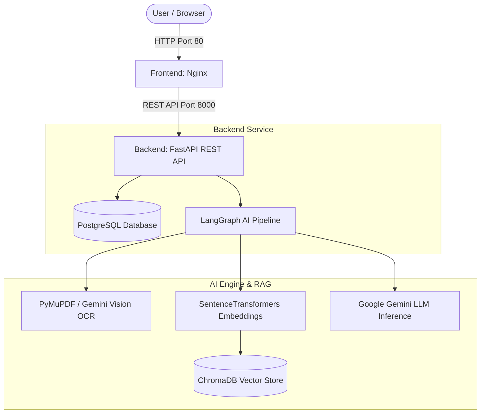

# ⚖️ AI Contract Reviewer - Full-Stack Enterprise Platform

[](https://fastapi.tiangolo.com/)
[](https://www.python.org/)
[](https://ai.google.dev/)
[](https://www.langchain.com/)
[](https://www.trychroma.com/)
[](https://www.postgresql.org/)
[](https://www.docker.com/)

An enterprise-grade, full-stack AI platform for automated legal contract ingestion, risk detection, indemnification exposure scoring, interactive RAG Q&A, and complete platform administration.

---

## 🌟 Key Features

- 📄 **Asynchronous Contract Analysis Pipeline**:
  - Ingestion of PDF legal documents with text extraction and image-rendering fallback (**Gemini Vision OCR** for scanned photo/image PDFs).
  - Sentence-transformer embeddings (`BAAI/bge-small-en-v1.5`) stored in a persistent **ChromaDB** vector database.
  - Multi-node stateful workflow orchestrated via **LangGraph**.
  - Risk exposure scoring (0–100), clause summarization, and key risk findings via **Google Gemini API**.

- 💬 **Interactive RAG Q&A**:
  - Context-aware contract Q&A endpoint (`POST /contracts/{id}/ask`).
  - Queries vectorized clause chunks in ChromaDB with keyword sentence fallback ranking for precise legal answers.

- 🛡️ **Role-Based Authentication & Admin Management Portal**:
  - Secure JWT authentication with HttpOnly session cookies and Bearer tokens.
  - Admin dashboard for user role promotion/demotion, contract status updates, search pagination, and system analytics.

- 🐳 **Containerized Architecture**:
  - Fully dockerized application orchestrated with Docker Compose (PostgreSQL, FastAPI Backend, Nginx Frontend).

---

## 🏗️ System Architecture



---

## 📁 Repository Directory Structure

```text
ai-contract-reviewer/
├── Backend/                         # FastAPI REST API & Neural AI Engine
│   ├── ai_engine/                   # LangGraph DAG workflow, RAG pipeline & ChromaDB
│   │   ├── graph/                   # LangGraph state & node execution graph
│   │   ├── services/                # Text extraction, chunking, embeddings, LLM & vector store
│   │   └── vector_store/            # Persistent ChromaDB vector index storage
│   ├── app/                         # FastAPI Application Core
│   │   ├── api/                     # Routers (Auth, Users, Contracts, Admin)
│   │   ├── core/                    # App settings & Pydantic config
│   │   ├── database/                # SQLAlchemy session provider & models
│   │   └── services/                # Business logic controllers
│   ├── alembic/                     # Database migration scripts
│   ├── Dockerfile                   # Python 3.10 backend container definition
│   ├── requirements.txt             # Python package dependencies
│   └── README.md                    # Backend API documentation
│
├── Frontend/                        # Client Web Application
│   ├── css/                         # Custom styling & glassmorphism UI theme
│   ├── js/                          # Unified API service layer & interaction scripts
│   ├── index.html                   # Landing page & Authentication (Login/Register)
│   ├── dashboard.html               # User contracts dashboard & file upload modal
│   ├── contract-detail.html         # Contract analysis report & interactive RAG Q&A
│   ├── admin.html                   # Administrator management control panel
│   └── Dockerfile                   # Nginx alpine web server container definition
│
├── docker-compose.yml               # Multi-container orchestration (Postgres, Backend, Frontend)
└── README.md                        # Root project documentation
```

---

## 🚀 Quick Start with Docker Compose

### Prerequisites

- [Docker Desktop](https://www.docker.com/products/docker-desktop/) (v20.10+) & Docker Compose installed.
- A **Google Gemini API Key** ([Get your API key here](https://aistudio.google.com/app/apikey)).

### 1. Clone Repository & Setup Environment

```bash
git clone https://github.com/parth123965-wq/AI-Contract-Reviewer.git
cd AI-Contract-Reviewer
```

Set your Gemini API key in your environment or update `docker-compose.yml`:

```bash
export GEMINI_API_KEY="your_actual_gemini_api_key"
```

### 2. Launch Services

Start all services in detached mode:

```bash
docker compose up --build -d
```

### 3. Access Application Services

- 🌐 **Web Application (Frontend)**: [http://localhost](http://localhost)
- 🔌 **FastAPI REST API Docs (Swagger UI)**: [http://localhost:8000/docs](http://localhost:8000/docs)
- 📖 **ReDoc Documentation**: [http://localhost:8000/redoc](http://localhost:8000/redoc)

---

## 🛠️ Local Manual Development Setup

If you prefer to run services individually outside Docker:

### 1. Backend Setup

```bash
cd Backend

# Create virtual environment
python -m venv .venv

# Activate virtual environment (Windows)
.venv\Scripts\activate

# Activate virtual environment (Linux/macOS)
source .venv/bin/activate

# Install dependencies
pip install -r requirements.txt

# Configure .env file
# Ensure DATABASE_URL and GEMINI_API_KEY are configured in Backend/.env

# Run database migrations
alembic upgrade head

# Start FastAPI dev server
uvicorn app.main:app --reload --host 127.0.0.1 --port 8000
```

### 2. Frontend Setup

Open `Frontend/index.html` in a web browser or serve using VS Code Live Server / static file server:

```bash
# Example static server using Python
cd Frontend
python -m http.server 5500
```

Access at `http://127.0.0.1:5500`.

---

## 🔌 API Summary

| Method | Endpoint | Description | Auth Required |
| :--- | :--- | :--- | :--- |
| `POST` | `/auth/register` | User account registration | No |
| `POST` | `/auth/login` | User login & JWT token retrieval | No |
| `GET` | `/users/me` | Fetch active user profile | Yes |
| `POST` | `/contracts/upload` | Ingest PDF contract & start AI graph | Yes |
| `GET` | `/contracts` | List user's contracts | Yes |
| `GET` | `/contracts/{id}` | Fetch detailed contract analysis | Yes |
| `POST` | `/contracts/{id}/ask` | Ask interactive RAG question on document | Yes |
| `GET` | `/admin/dashboard/stats`| Platform statistics analytics dashboard | Admin |
| `GET` | `/admin/users` | List platform users (paginated) | Admin |
| `GET` | `/admin/contracts` | List all user contracts across platform | Admin |

---

## 🛡️ License

Distributed under the **MIT License**. See `LICENSE` for details.
