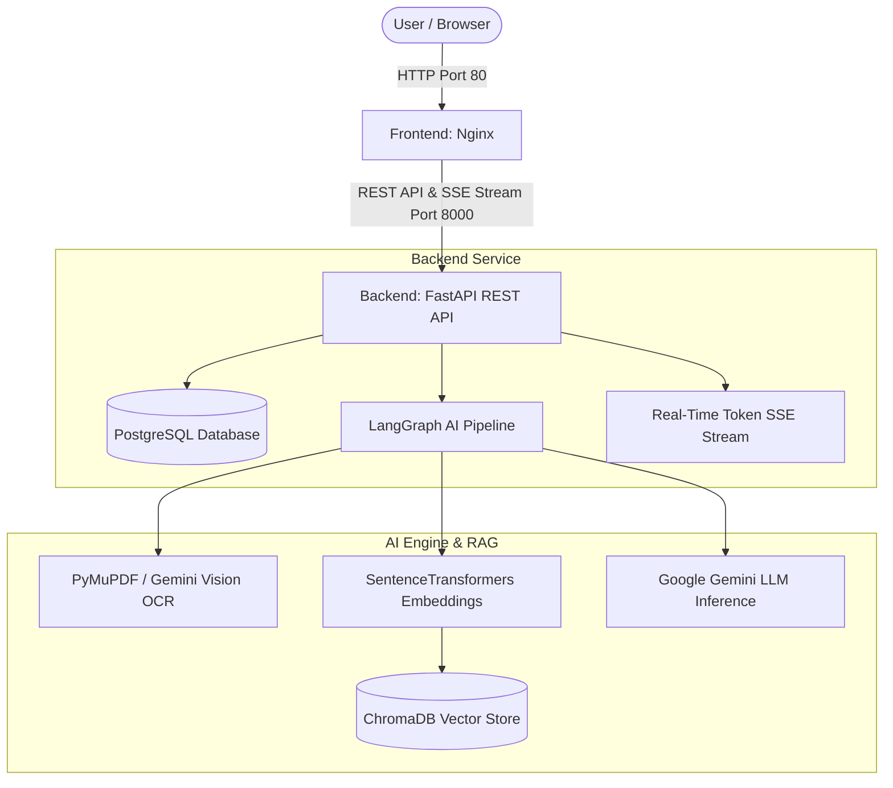

# ⚖️ AI Contract Reviewer - Full-Stack Enterprise Platform

[](https://fastapi.tiangolo.com/)
[](https://www.python.org/)
[](https://ai.google.dev/)
[](https://www.langchain.com/)
[](https://www.trychroma.com/)
[](https://www.postgresql.org/)
[](https://www.docker.com/)

An enterprise-grade, full-stack AI platform for automated legal contract ingestion, risk detection, indemnification exposure scoring, real-time streaming RAG Q&A (ChatGPT/Gemini style), and complete platform administration.

---

## 🌟 Key Features

- 📄 **Asynchronous Contract Analysis Pipeline**:
  - Ingestion of PDF legal documents with text extraction and image-rendering fallback (**Gemini Vision OCR** for scanned photo/image PDFs).
  - Sentence-transformer embeddings (`BAAI/bge-small-en-v1.5`) stored in a persistent **ChromaDB** vector database.
  - Multi-node stateful workflow orchestrated via **LangGraph**.
  - Risk exposure scoring (0–100), clause summarization, and key risk findings via **Google Gemini API**.

- ⚡ **Real-Time Token Streaming RAG Q&A**:
  - Real-time token streaming Q&A endpoint (`POST /contracts/{id}/ask`).
  - Streams answers token-by-token using FastAPI `StreamingResponse` (Server-Sent Events / SSE) and frontend `ReadableStream` reader without blocking or page freezes.

- 🎨 **College Showcase Glassmorphic UI**:
  - Ultra-premium midnight dark cyber theme with frosted glassmorphism (`backdrop-filter: blur`), Google Fonts (`Outfit` & `Inter`), glowing neon accents, drag-and-drop dropzone, and interactive radial SVG risk gauges.

- 🛡️ **Role-Based Authentication & Admin Management Portal**:
  - Secure JWT authentication with HttpOnly session cookies and Bearer tokens.
  - Admin dashboard for user role promotion/demotion, contract status updates, search pagination, and system analytics.

- 🐳 **Containerized Architecture**:
  - Fully dockerized application orchestrated with Docker Compose (PostgreSQL, FastAPI Backend, Nginx Frontend).

---

## 🏗️ System Architecture



---

## 📁 Repository Directory Structure

```text
ai-contract-reviewer/
├── Backend/                         # FastAPI REST API & Neural AI Engine
│   ├── ai_engine/                   # LangGraph DAG workflow, RAG pipeline & ChromaDB
│   │   ├── graph/                   # LangGraph state & node execution graph
│   │   ├── services/                # Text extraction, chunking, embeddings, LLM streaming & vector store
│   │   └── vector_store/            # Persistent ChromaDB vector index storage
│   ├── app/                         # FastAPI Application Core
│   │   ├── api/                     # Routers (Auth, Users, Contracts, Admin)
│   │   ├── core/                    # App settings & Pydantic config
│   │   ├── database/                # SQLAlchemy session provider & models
│   │   └── services/                # Business logic controllers
│   ├── alembic/                     # Database migration scripts
│   ├── Dockerfile                   # Python 3.10 backend container definition
│   ├── requirements.txt             # Python package dependencies
│   └── README.md                    # Backend API documentation
│
├── Frontend/                        # Client Web Application
│   ├── css/                         # Custom styling & glassmorphism UI theme
│   ├── js/                          # Unified API service layer, streaming reader & interaction scripts
│   ├── index.html                   # Landing page & Authentication (Login/Register)
│   ├── dashboard.html               # User contracts dashboard & file upload modal
│   ├── contract-detail.html         # Contract analysis report & real-time RAG Q&A stream
│   ├── admin.html                   # Administrator management control panel
│   └── Dockerfile                   # Nginx alpine web server container definition
│
├── docker-compose.yml               # Multi-container orchestration (Postgres, Backend, Frontend)
└── README.md                        # Root project documentation
```

---

## 🚀 Quick Start with Docker Compose

### Prerequisites

- [Docker Desktop](https://www.docker.com/products/docker-desktop/) (v20.10+) & Docker Compose installed.
- A **Google Gemini API Key** ([Get your API key here](https://aistudio.google.com/app/apikey)).

### 1. Clone Repository & Setup Environment

```bash
git clone https://github.com/parth123965-wq/AI-Contract-Reviewer.git
cd AI-Contract-Reviewer
```

Set your Gemini API key:
```bash
# Windows PowerShell
$env:GEMINI_API_KEY="your_actual_gemini_api_key_here"

# Linux / macOS
export GEMINI_API_KEY="your_actual_gemini_api_key_here"
```

### 2. Launch Docker Services

```bash
docker-compose up -d --build
```

Access the application in your browser:
- 🌐 **Frontend Web App**: `http://localhost`
- ⚡ **Backend REST API**: `http://localhost:8000`
- 📚 **Interactive Swagger API Docs**: `http://localhost:8000/docs`
